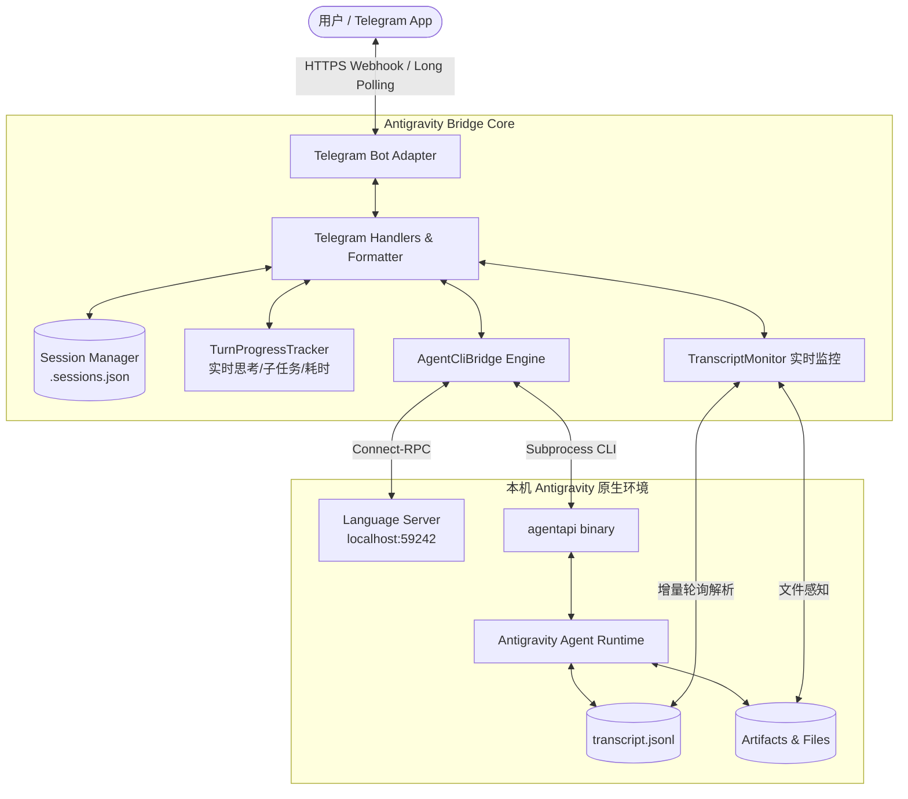
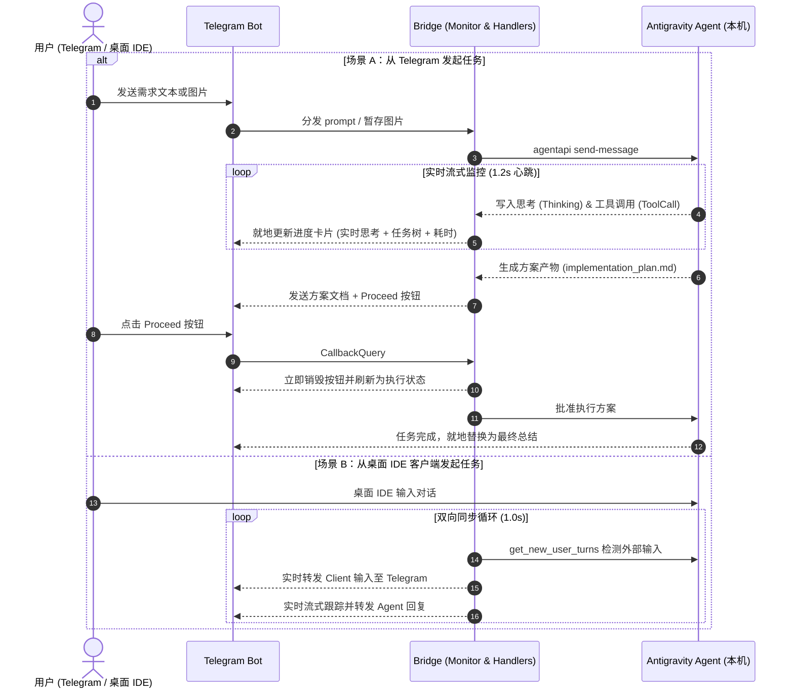

# Antigravity Telegram Remote Controller

[](https://www.python.org/)
[](LICENSE)
[](https://antigravity.google)
[](https://github.com/astral-sh/ruff)

将你本机运行的 **Google Antigravity Agent** 原生桥接至 **Telegram Bot**。让手机或任何移动设备成为你在外远程遥控本机 Agent 编写代码、执行终端操作、阅读工程成果的全双工智能终端。

---

## 核心特性

1. **纯本地原生桥接，零云端 API Key 依赖**
   - 直连本机运行的 Antigravity 宿主进程、Language Server（端口 `59242`）与原生 `agentapi` 命令行工具。
   - 自动复用本地 IDE 登录凭证与权限沙箱，**无需申请或配置任何 Gemini API Key**。
2. **实时思考流与动态进度仪表盘 (Thinking & Progress Dashboard)**
   - 实时在 Telegram 端呈现 Agent 的 `<thought>` 深度思考过程。
   - **子任务状态树**：清晰展示工具调用状态（`[DONE]` 已完成 / `[RUNNING]` 执行中 / `[PENDING]` 待执行）。
   - **动态耗时心跳**：内置秒级动态耗时计算器（如 `⏱ 12s`），任务执行节奏一览无余。
3. **桌面客户端与手机全双工双向实时同步 (Full-Duplex Sync)**
   - 手机端与电脑 IDE 客户端完全打通！
   - 无论是在 Telegram 还是在 Antigravity 桌面客户端中对话，Telegram 均能增量捕获 `USER_INPUT` 并实时流式转发 Agent 的思考卡片与最终回复。
4. **阻塞性方案审批与即点即消 (Artifact Approval & Proceed)**
   - 当 Agent 在 Planning 模式下生成 `implementation_plan.md` 等需审核产物时，机器人会自动将方案文档发送至手机，并附带 **`Proceed (批准执行)`** 按钮。
   - **即点即消机制**：点击后按钮立即销毁，就地刷新为正在执行状态，杜绝任何多余按钮残留与重复弹窗。
5. **原生交互式决策问答 (ask_question Interactive Buttons)**
   - 当 Agent 调用 `ask_question` 遇到分支决策时，Telegram 端实时弹出原生内联按钮（Inline Keyboard）。
   - 单选点击即确认；多选支持多选框动态切换（`[ ]` / `[X]`）与批量提交，并提供跳过选项。
   - 兼容在聊天框直接输入数字序号（如 `1` 或 `1, 2`）或自定义文本回复。
6. **全双工多模态感知与成果回传 (Multimodal Input & Output)**
   - **手机视觉输入**：直接向 Telegram 发送截图或照片，自动存入 `.user_uploaded/` 目录供 Agent 调用视觉分析。
   - **成果自动送达**：Agent 生成的任何图片（`png`/`jpg`/`webp`）或产物文件（`pdf`/`xlsx`/`zip` 等），自动转化为原生图片/文件卡片直接发送给用户。
7. **对标 `dsh-im` 的完整会话控制与模型热切换**
   - 丰富的会话管理命令（`/new`、`/session`、`/sessions`、`/status`、`/history`）。
   - 本地工作区自由切换（`/workspace`）。
   - 批量消息暂存模式（`/batch`、`/send`、`/cancel`）。
   - **模型热切换**：通过 RPC 实时拉取 Language Server 可用模型列表，支持层级序号（如 `/model 1`、`/model 1.1`、`/model sonnet`）与内联面板切换。
8. **安全访问控制**
   - 支持通过 `ALLOWED_USERS` 配置 Telegram 用户 ID 白名单，杜绝未授权人员远程操作你的计算机。

---

## 系统架构设计

### 1. 系统架构图



### 2. 交互与同步时序图



### 3. 代码目录结构

```
Antigravity-TGBot/
├── run.sh                                # 服务管理脚本 (支持 start/stop/restart/status/logs)
├── bot.py                                # 主程序启动入口
├── requirements.txt                      # 运行依赖
├── .env.example                          # 环境变量配置模板
├── .sessions.json                        # 会话绑定与工作区持久化文件
├── antigravity_bridge/
│   ├── core/                             # 核心引擎层
│   │   ├── agent_cli.py                  # agentapi CLI 异步封装与 Language Server RPC 通信
│   │   ├── transcript_monitor.py         # transcript.jsonl 增量解析、思考/工具流监控
│   │   ├── session_manager.py            # 多用户/多群组会话状态与工作区持久化
│   │   └── models.py                     # 事件定义、模型列表、数据结构
│   └── adapters/                         # 表现层与平台适配器
│       ├── base.py                       # 多 IM 平台统一适配器抽象基类
│       └── telegram/                     # Telegram 具体适配实现
│           ├── bot.py                    # Bot 生命周期管理与外部客户端会话双向同步循环
│           ├── handlers.py               # 消息分发、内联按钮、审批闭环与流式进度呈现
│           └── formatter.py              # 文本防抖节流器 (ThrottledEditor) 与 Markdown 切片
└── tests/                                # 自动化测试套件
    ├── test_artifact_approval.py         # 方案审批与产物过滤单测
    ├── test_button_cleanup.py            # 内联按钮即点即消与去重单测
    ├── test_external_turn_sync.py        # 桌面客户端对话双向同步单测
    ├── test_progress_tracker.py          # 进度树与动态耗时解析单测
    └── test_stream_turn_events.py        # 完整流式事件生命周期单测
```

---

## 快速开始

### 1. 环境准备
- macOS 或 Linux 系统。
- 已安装并启动 [Antigravity IDE / App](https://antigravity.google)。
- Python 3.10 及以上。

### 2. 获取 Telegram Bot Token
1. 在 Telegram 中私聊官方机器人 [@BotFather](https://t.me/BotFather)。
2. 发送 `/newbot`，根据提示创建一个新的机器人并保存生成的 API Token。
3. （强烈推荐）向 [@userinfobot](https://t.me/userinfobot) 发送任意消息，获取你自己的 Telegram User ID。

### 3. 配置环境变量
在项目根目录下复制 `.env.example` 为 `.env` 并填写配置：

```bash
cp .env.example .env
```

编辑 `.env`：
```env
# 1. 必填：你的 Telegram Bot Token
TELEGRAM_BOT_TOKEN="123456789:ABCdefGHIjklMNOpqrSTUvwxyz"

# 2. 强烈建议：填写你的 Telegram 用户 ID (多个用逗号隔开)，只允许授权人员控制！
ALLOWED_USERS="12345678"

# 3. 选填：新会话的默认模型等级 (flash_lite | flash | pro)
DEFAULT_MODEL="flash"

# 4. 选填：默认工程工作区目录 (留空默认为当前项目目录)
DEFAULT_WORKSPACE="/Users/evasi0nxiao/Antigravity-TGBot"
```

### 4. 启动与管理服务

本项目提供开箱即用的服务管理脚本 `./run.sh`：

```bash
./run.sh start     # 后台启动守护服务
./run.sh status    # 查看当前运行状态与 PID
./run.sh logs      # 查看实时滚动日志 (按 Ctrl+C 退出查看)
./run.sh restart   # 一键优雅重启
./run.sh stop      # 停止后台服务
```

> **提示**：开发调试时也可以直接在前台运行 `./run.sh` 或 `python3 bot.py`。

---

## 指令大全 (Commands Reference)

| 指令 | 简写/别名 | 参数 | 功能说明 |
| :--- | :--- | :--- | :--- |
| `/start` | - | 无 | 显示欢迎信息与快速控制指引 |
| `/help` | - | 无 | 查看完整遥控手册（对标 `dsh-im` 标准） |
| `/new` | - | `[序号\|名称] [标题]` | 开启新会话并自动绑定到当前 Telegram 聊天 |
| `/session` | `/s` | `<会话ID>` | 绑定当前聊天至指定的已有 Antigravity 会话 |
| `/sessions`| `/list` | `[条数]` | 列出本地最近的 Antigravity 会话列表 |
| `/status` | - | 无 | 查看当前会话 ID、模型、工作区路径及运行状态 |
| `/models` | `/modellist`| 无 | 列出当前所有可用模型清单、序号、规格与当前选择 |
| `/model` | - | `[序号\|别名]` | 查看当前模型，或切换模型（支持序号如 `/model 1`、`/model 5`） |
| `/workspace`| `/ws` | `[路径]` | 查看或原地切换本地工程工作区绝对路径 |
| `/history` | - | `[条数]` | 查看当前会话最近的历史交互记录 |
| `/batch` | - | 无 | 开启批量聚合模式，后续输入暂存至缓冲区 |
| `/send` | - | 无 | 将缓冲区内所有内容合并为一个完整任务派发执行 |
| `/cancel` | - | 无 | 退出批量模式并清空缓冲区 |
| `/stop` | - | 无 | 停止当前正在生成的回复或正在执行的任务 |

> **自由对话**：直接在聊天框发送普通文本，Bot 会自动转发至当前绑定的 Antigravity 会话执行；直接发送图片则自动触发 Agent 的视觉理解能力！

---

## 可用模型清单与动态切换

本系统直连本机 Language Server 获取实时可用模型与配额，支持 **层级序号**、**主序号** 及 **语义别名** 模糊匹配：

| 主序号 | 层级编号 | 模型名称 | 规格标签 | 特点与适用场景 | 常用别名 |
| :---: | :---: | :--- | :---: | :--- | :--- |
| **1** | `1.1` | **Gemini 3.8 Flash (High)** | `High / Fast` | 默认推荐，新一代多模态旗舰 Flash，高智商与毫秒级极速响应 | `1`, `3.8`, `flash`, `flash-high` |
| | `1.2` | Gemini 3.8 Flash (Medium) | `Medium / Thinking`| 均衡档位，思考增强与适度资源控制 | `3.8-medium` |
| | `1.3` | Gemini 3.8 Flash (Low) | `Low / Fast` | 快速低开销档位 | `3.8-low` |
| **2** | `2.1` | **Gemini 3.7 Flash (High)** | `High / Thinking` | 经典稳定高效通用模型，综合能力优秀 | `2`, `3.7`, `flash-3.7` |
| | `2.2` | Gemini 3.7 Flash (Medium) | `Medium / Thinking`| 经典通用均衡档位 | `3.7-medium` |
| **3** | `3.1` | **Gemini 3.6 Flash (High)** | `Medium / Fast` | 极速轻量模型，开销极低，适合常规问答与简单代码探索 | `3`, `3.6`, `lite`, `flash_lite` |
| **4** | `4.1` | **Gemini 3.1 Pro (High)** | `High / Reasoning` | 专业级深层推理模型，适合大型项目架构设计与高难度逻辑解题 | `4`, `3.1`, `pro`, `gemini-pro` |
| | `4.3` | Gemini 2.5 Pro | `Thinking` | 经典 2.5 思考推理模型 | `2.5-pro` |
| **5** | `5` | **Claude Sonnet 4.6 (Thinking)** | `Thinking` | Anthropic 思考增强模型，超强代码生成与复杂算法推理 | `5`, `sonnet`, `claude` |
| **6** | `6` | **Claude Opus 4.6 (Thinking)** | `Thinking` | Anthropic 顶级超旗舰模型，处理极度复杂的工程与深度推理任务 | `6`, `opus` |
| **7** | `7` | **GPT-OSS 120B (Medium)** | `Medium / Thinking`| 开源大参数旗舰模型，兼具高容量与中等推理能力 | `7`, `gpt`, `oss`, `120b` |

> **切换示例**：
> - 输入 `/model 1` 或 `/model flash`：原地切换至推荐的 Gemini 3.8 Flash (High)。
> - 输入 `/model 5` 或 `/model sonnet`：原地切换至 Claude Sonnet 4.6 (Thinking)。
> - 输入 `/model 4` 或 `/model pro`：原地切换至 Gemini 3.1 Pro (High)。
> - 发送 `/models`：弹出交互式内联键盘，直接点击对应按钮完成切换，按钮在点击后立即自动销毁。

---

## 扩展其他 IM 平台 (Extensibility)

本项目采用高度解耦的适配器设计模式。如需增加对 Discord、Slack、飞书或企微的支持：

1. 继承 `antigravity_bridge/adapters/base.py` 中的 `BaseBotAdapter` 基类。
2. 实现 `start()`、`stop()` 及消息发送方法。
3. 平台接收到消息后，直接复用 `self.agent_cli.send_message()` 与 `self.monitor.stream_events()` 获取全套思考流、工具状态与产物审批能力。

---

## 运行安全须知

Antigravity Agent 在本机具备强大的执行能力（读写本地文件、执行终端 shell 命令等），**请务必在 `.env` 中正确配置 `ALLOWED_USERS`**，切勿将机器人暴露在未经白名单鉴权的公开群组中。
